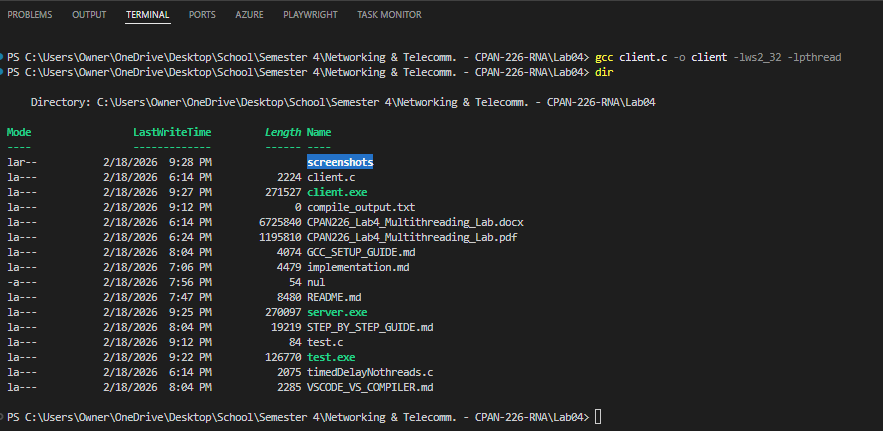
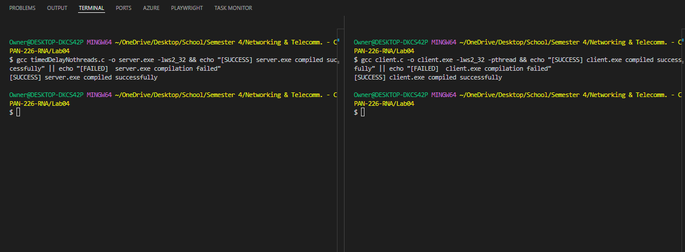
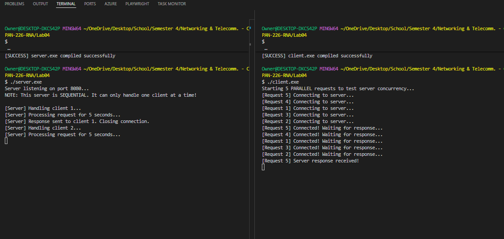
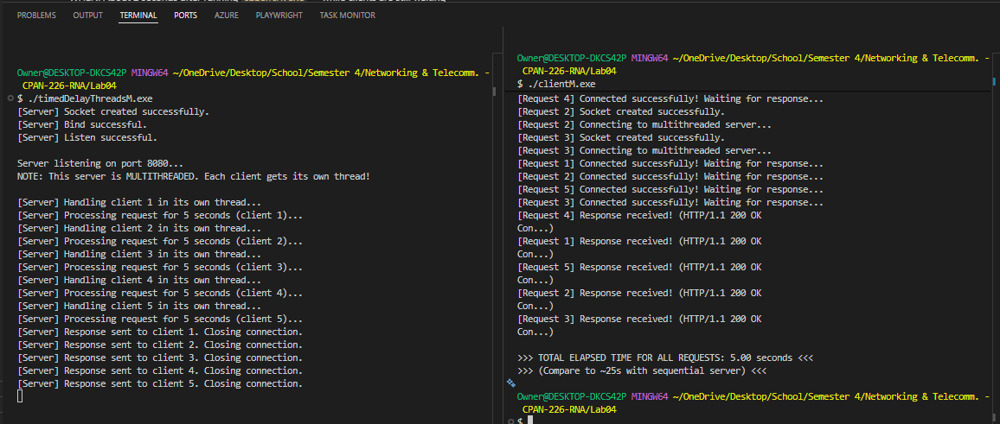
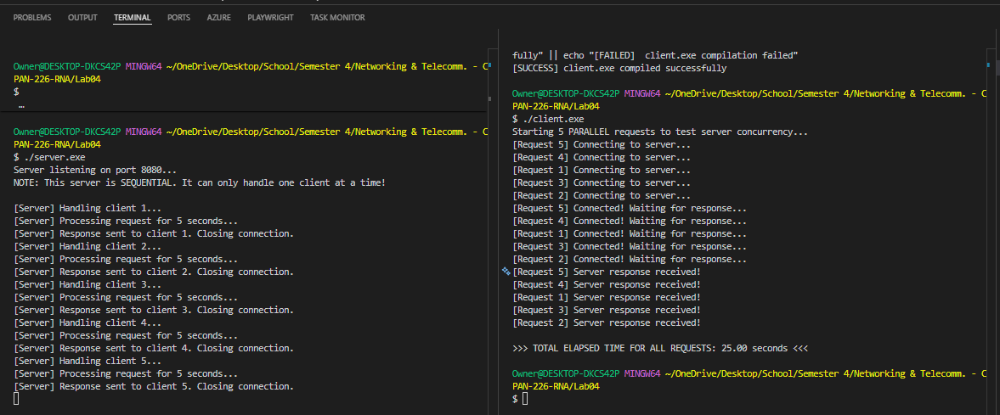

# P2P Academic Resource Sharing Network

**Course:** CPAN226 - Network Programming &nbsp;|&nbsp; **Term:** Winter/Summer 2026  
**Project Theme:** #6 - P2P Academic Resource Sharing Network (Java)  
**Submission Deadline:** April 17, 2026 &nbsp;|&nbsp; **Format:** Individual Project

---

## Overview

A decentralized peer-to-peer file-sharing system built with Java Sockets, designed around academic resource sharing. Students on the same local network can discover peers, share files (lecture notes, PDFs, slides), and download resources directly from one another -- no central server required.

The system focuses on two core concerns: **data integrity** via SHA-256 checksums, and **graceful handling of packet loss and disconnections** through timeout detection and automatic retry logic.

---

## Architecture

Each node runs as both a server and a client (hybrid P2P). Two protocols work in parallel:

```
+------------------------------------------------------+
|                     P2P Network                      |
|                                                      |
|   +------------+      UDP Discovery      +----------+|
|   |   Peer A   | <----------------------> |  Peer B  ||
|   |            |                          |          ||
|   | TCP Server | <-- file request (TCP) --|TCP Client||
|   | (port 6000)| --> file data (chunked)->|          ||
|   +------------+                          +----------+|
+------------------------------------------------------+
```

| Component | Role |
|---|---|
| `PeerNode` | Main entry point - starts the TCP server and UDP listener |
| `TCPServer` | Listens for incoming file requests; serves files in 4 KB chunks |
| `TCPClient` | Connects to a remote peer's TCP server; handles chunked downloads |
| `UDPDiscovery` | Broadcasts peer presence every 10 s; maintains a live peer registry |
| `FileManager` | Indexes the local shared folder; generates SHA-256 checksums |
| `IntegrityChecker` | Verifies received file checksums; triggers retry on mismatch |

---

## Source Code

All Java classes live in [`p2p-academic-sharing/src/com/cpan226/p2p/`](p2p-academic-sharing/src/com/cpan226/p2p/).

| Class | Link | Description |
|---|---|---|
| `PeerNode` | Main entry point - starts the TCP server and UDP listener |
| `TCPServer.java` | [View](p2p-academic-sharing/src/com/cpan226/p2p/TCPServer.java) | **File server.** Opens a `ServerSocket`, accepts incoming peer connections in a thread pool, handles `LIST` and `GET` requests, and streams files in 4 KB chunks with a `SIZE + CHECKSUM` header. |
| `TCPClient.java` | [View](p2p-academic-sharing/src/com/cpan226/p2p/TCPClient.java) | **File downloader.** Connects to a remote peer's TCP server, sends a `GET` request, reassembles chunked binary data, and hands the result off to `IntegrityChecker` for SHA-256 validation. |
| `UDPDiscovery.java` | [View](p2p-academic-sharing/src/com/cpan226/p2p/UDPDiscovery.java) | **Peer discovery.** Broadcasts a `PEER_ANNOUNCE` datagram every 10 s on port 9000, listens for announcements from other peers, and maintains a live peer registry (entries expire after 30 s of silence). |
| `FileManager.java` | [View](p2p-academic-sharing/src/com/cpan226/p2p/FileManager.java) | **Local file index.** Scans the shared folder, builds a name-path map, and generates SHA-256 checksums on demand. Also guards against path-traversal attacks when resolving requested filenames. |
| `IntegrityChecker.java` | [View](p2p-academic-sharing/src/com/cpan226/p2p/IntegrityChecker.java) | **Download verifier.** Computes the SHA-256 hash of a received file and compares it to the sender's checksum. Triggers up to 3 automatic retries on mismatch before surfacing an error. |

---

## Project Structure

```
p2p-academic-sharing/
├── src/com/cpan226/p2p/
│   ├── PeerNode.java           ← Main entry point
│   ├── TCPServer.java          ← Serves files to requesting peers
│   ├── TCPClient.java          ← Downloads files from remote peers
│   ├── UDPDiscovery.java       ← Peer broadcast & registry
│   ├── FileManager.java        ← Local file index & chunking
│   └── IntegrityChecker.java   ← SHA-256 verification & retry
├── out/                        ← Compiled .class files (generated)
├── shared-a/                   ← Peer A's shared folder
├── shared-b/                   ← Peer B's shared folder
├── downloads/                  ← Received files land here
├── screenshots/                ← Demo screenshots
├── compile.bat                 ← Compile helper (Windows)
└── run.bat                     ← Launch helper (Windows)
```



---

## Technical Stack

| Layer | Technology |
|---|---|
| Language | Java 21 (LTS) |
| Transport | TCP (file transfer) + UDP (peer discovery) |
| Integrity | SHA-256 via `java.security.MessageDigest` |
| Concurrency | Java Threads / `ExecutorService` |
| I/O | `java.io` / `java.nio` |
| Build | `javac` / `compile.bat` |

---

## Running Locally

### Prerequisites

- Java 21 (LTS)
- Two terminal windows (simulates two peers on one machine)

### Compile

```bash
# Windows
compile.bat

# or manually
javac -encoding UTF-8 -d out src\main\java\com\cpan226\p2p\*.java
```



### Start Peer A

```bash
run.bat --port 6000 --shared shared-a
```

### Start Peer B (second terminal)

```bash
run.bat --port 6001 --shared shared-b
```

Peer B will automatically discover Peer A via the UDP broadcast within 10 seconds. Use the CLI commands below to interact.

**Pre-demo file setup:**
- `shared-a/` — place 2–3 sample files here (e.g., `lecture1_sockets.txt`, `notes_tcp_vs_udp.txt`)
- `shared-b/` — leave empty; Peer B will download from Peer A
- `downloads/` — received files appear here after a successful transfer

---

## CLI Commands

| Command | What it does |
|---|---|
| `peers` | List all discovered peers |
| `list <peer#>` | List files available on a specific peer |
| `get <peer#> <filename>` | Download a file from that peer |
| `exit` | Shut down the peer node |

---

## Network Protocol

### UDP Discovery — Port 9000

Peers broadcast a short announcement every 10 seconds:

```
PEER_ANNOUNCE|<hostname>|<TCP_port>|<file_count>
```

Receiving peers update their local registry. A peer is removed after 30 s of silence.

### TCP File Transfer — Port 6000+

```
Request:   GET <filename>\n
Response:  SIZE <bytes>\nCHECKSUM <sha256>\n<binary data>
```

After receiving all chunks the client computes the SHA-256 hash and responds with `ACK OK` or `ACK RETRY`. Up to three retries are attempted before an error is surfaced.



---

## File Transfer & Download

Files are transferred in 4 KB chunks over TCP. The server sends the file size and SHA-256 checksum in a header before streaming the binary payload. The client reassembles the chunks and verifies integrity before saving to `downloads/`.



---

## Data Integrity & Packet Loss

| Scenario | Handling |
|---|---|
| Incomplete transfer | Receiver detects size mismatch — retransmission requested |
| Checksum mismatch | Auto-retry up to 3×, then error reported to user |
| Peer disconnects mid-transfer | 30 s socket timeout — retry attempted from peer registry |
| Peer leaves network | UDP heartbeat expires — peer removed from registry after 30 s |



---

## Scope

**In scope:** Java Socket-based P2P communication, UDP peer discovery, chunked TCP file transfer, SHA-256 verification, retry logic, basic CLI.

**Out of scope:** GUI, TLS encryption, NAT traversal, distributed hash table (DHT).

---

## Submission Checklist

### Code
- [ ] `PeerNode.java`
- [ ] `TCPServer.java`
- [ ] `TCPClient.java`
- [ ] `UDPDiscovery.java`
- [ ] `FileManager.java`
- [ ] `IntegrityChecker.java`

### Deliverables
- [ ] GitHub repository link (source code + this README)
- [ ] YouTube video link — unlisted screen recording, max 5 minutes

---

*CPAN226 — Network Programming | April 2026*
